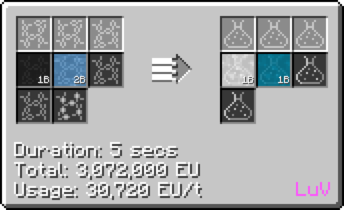
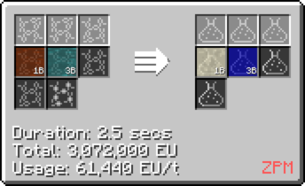
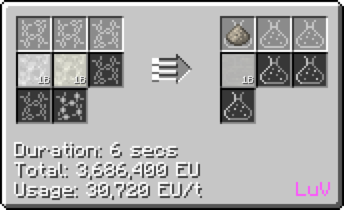
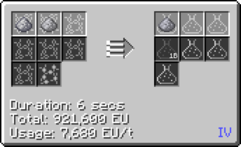
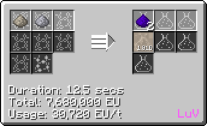
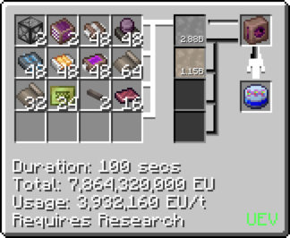
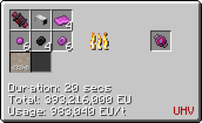
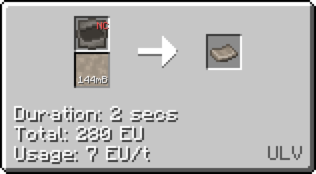
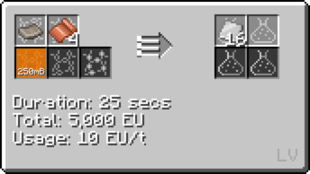

# PEEK (Polyether Ether Ketone)

PEEK is a type of plastic that is widely used late-game. In reality, it is a colourless organic thermoplastic polymer in the polyaryletherketone (PAEK) family, used in engineering applications. 

## How to Make PEEK

**PEEK is mainly made from *4,4-Difluorobenzophenone Dust* and *Disodium Salt of Hydroquione dust***

### How to make 4,4-Difluorobenzophenone Dust

Step **1**: Obtain Fluorobenzene by chemically reacting Fluorine Gas with Benzene. **(LuV LCR)**

Step **2**: Obtain **Benzotrichloride** by chemically reacting **Chlorine Gas** with **Toluene**. **(ZPM LCR)**

Step **3**: Obtain **Benzoyl Chloride** by chemically reacting **Benzotrichloride** with **Water**. **(LuV LCR)**

Step **4**: Obtain **4-Fluorobenzoyl Chloride** by chemically reacting **Benzoyl Chloride** with **Hydrogen**. **(LuV LCR)**

Step **5**: Obtain **4,4-Difluorobenzophenone Dust** by chemically reacting **4-Fluorobenzoyl Chloride** and **Fluorobenzen**. **(LuV LCR)**

### How to make Disodium Salt of Hydroquione dust

Step **1**: Obtain **Soda Ash Dust** by chemically reacting **Sodium Hydroxide Dust** and **Carbon Dioxide**. **(HV LCR)**

Step **2**: Obtain **Hydroquione Dust** from chemically reacting **Benzene**, **Propene** and **Oxygen**. **(ZPM LCR)**

Step **3**: Obtain **Disodium Salt of Hydroquione dust** by chemically reacting **Soda Ash Dust** and **Hydroquione Dust**. **(IV LCR)**

### Making PEEK

**Obtain PEEK by chemically reacting *Disodium Salt of Hydroquione dust* and *4,4-Difluorobenzophenone Dust*. (LuV LCR)**

**Another way of crafting PEEK is to use the Chemical Plant you can craft when you reach ZPM tier.**

**Note that the PEEK recipe requires UHV overclocking.**

***PEEK = Soda Ash Dust + Benzene + Propene + Oxygen (UHV Chemical Plant)***

## Uses of PEEK

**Crafting of UHV hatches in the assembler**

**Crafting of PEEK Casings**

**Used as fluid in assembly lines**

 

**Uncraftable at Epsilon*

**Used in UHV component crafting**

### Uses of PEEK foil

**Fluid Solidify PEEK into PEEK ingots**

**Bend the ingots into foil (Cir 10)**

**Used as a crafting item in assembly line recipes**
 

**Uncraftable at Epsilon*

### Uses of PEEK plate

**Fluid solifify PEEK into plate**

**Used to craft UHV hulls**

**Used to make plastic circuit boards**

