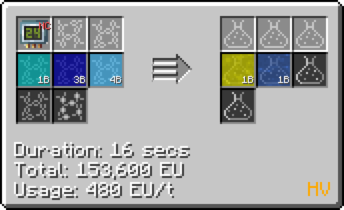
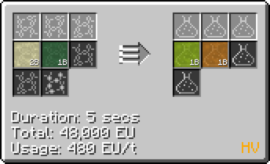
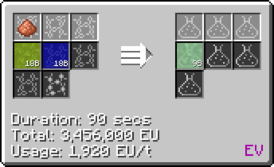
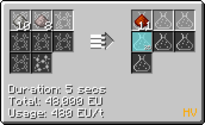
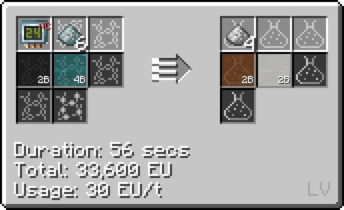

# Polybenzimidazole

Polybenzimidazole is a kind of rubber that are mainly used in assembling recipes, such as different input and output busses/hatches.
It is also used in making Plastic Circuit Boards.

## How to make Polybenzimidazole

**Polybenzimidazole is mainly made from *Diaminobenzidine* and *Diphenyl Isophthalate*.**

*Chemically React Diaminobenzidine and Diphenyl Isophthalate to obtain Polybenzimidazole.*

Polybenzimidazole = Diaminobenzidine + Diphenyl Isophthalate (**IV LCR**)

### How to make Diaminobenzidine

Step **1**: Mix Nitric Acid **(HV LCR)** and Sulfuric Acid to make Nitration Mixture.

Nitric Acid = Nitrogen + Oxygen + Hydrogen **(LCR Cir 24)**

Nitration Mixture = Nitric Acid + Sulfuric Acid **(Mixer)**

Step **2**: Chemically react Chlorobenzene with **Circuit 1** and Nitration Mixture to make Nitrochlorobenzene. **(HV LCR required)**

Chlorobenzine : Chlorine Gas + Benzene **(LCR Cir 1)** 

Nitrochlorobenzene : Chlorobenzine + Nitration Mixture **(HV LCR required)**

Step **3** : Chemically react Nitrochlorobenzene, Hydrogen and a tiny pile of copper dust to obtain Dichlorobenzidine.

Dichlorobenzidine = Nitrochlorobenzene + Hydrogen + Tiny pile of Copper Dust **(EV LCR required)**

Step **4** : Chemically react Dichlorobenzidine, Ammonia and Zinc Dust (Not consumed) to obtain Diaminobenzidine.

Ammonia = Hydrogen + Nitrogen **(HV LCR Cir 1)**

Diaminobenzidine = Dichlorobenzidine + Ammonia + Zinc dust (NC) **(IV LCR required)**

### How to make Diphenyl Isophthalate

Step **1**: Chemically React Potassium Dichromate, Dimethylbenzene and Oxygen to obtain Phthalic Acid.

Chromium Trioxide = Chromium Dust + Oxygen **(MV LCR)**

Potassium Dichromate = Chromium Trioxide + Saltpeter Dust **(HV LCR)**

Dimethylbenzene = Methane + Benzene **(Cir 1 MV LCR)**

Phthalic Acid = Potassium Dichromate + Dimethylbenzene + Oxygen **(EV LCR)**

Step **2**: Obtain Phenol

*Note that Phenol is a byproduct of making Diaminobenzidine*

There are 2 ways of obtaining phenol through the **LCR**:

1.Benzene + Chlorine + Water = Phenol + Hydrochloric Acid + Diluted HCl (**LCR Cir 24**)

2.Benzene + Chlorine + Sodium Hydroxide = Phenol + HCl + Salt (**LCR Cir 24**)

Step **3**: Obtain Diphenyl Isophthalate

Diphenyl Isophthalate = Phthalic Acid + Phenol + Sulfuric Acid (**IV LCR**)

## Uses of Polybenzimidazole

**Making Plastic Circuit Boards**

**Making Input/Output Busses/Hatches**

**Turning into sheets for machine hulls**

**ZPM Machine Hull**

