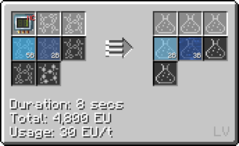
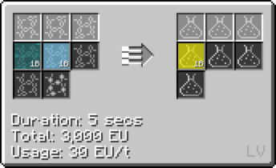
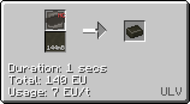
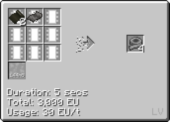

# Polycaprolactam 

**(Polycaprolactone) (PCL)**

## How to make Polycaprolactam

**Step 1: Obtain Cyclohexane by combining Nickel Dust(NC), Benzene and Hydrogen (<hv>HV</hv> LCR)**

**Step 2: Obtain Nitric Oxide by combining Nitrogen Oxide and Ammonia**

**Step 3: Obtain Nitrosyl Chloride by combining Nitric Oxide and Chlorine**

**Step 4: Combine Nitrosyl Chloride and Cyclohexane to obtain Cyclohexanone Oxime Dust and [Hydrochloric Acid](/trulyno/StarT-docs/Gameplay/Lines/Chemical Lines/Random Useful Chemicals/Hydrochloric Acid)**

**Step 5: Obtain Polycaprolactam Dust by combining Cyclohexanone Oxime Dust and [Sulfuric Acid](/trulyno/StarT-docs/Gameplay/Lines/Chemical Lines/Random Useful Chemicals/Sulfuric Acid)**

**Step 6: PUt Cyclohexanone Oxime Dust in an EBF with Nitrogen to get Polycaprolactam Ingots (Cupronickel <mv>MV</mv> EBF)**

## Uses of Polycaprolactam Ingots

**Fluid Solidify PCL into ingots**

**Making string (<mv>MV</mv> Extruder** )

## Uses of PCL Foil

**Making FAL tape**

