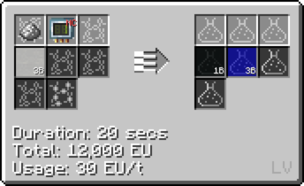
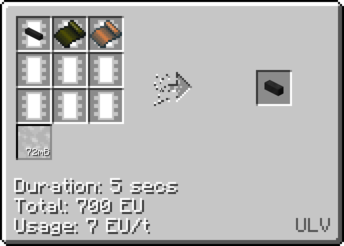
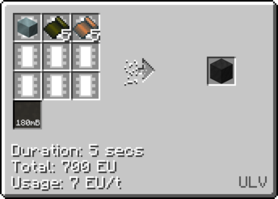

# Polyphenylene Sulfide

## How to make Polyphenylene Sulfide

**Step 1: Chemically react Sodium dust and Sulfur dust to obtain Sodium Sulfide(LCR)**

**Step 2 Option 1: Chemically react Chlorine and Benzene to obtain Dichlorobenzene(LCR Cir 2)**

**Step 2 Option 2: Chemically react Iron(III)Chloride and Chlorobenzene to obtain Dichlorobenzene(LCR)**

**Obtain Iron(III)Chloride by chemically reacting Iron Dusts and [Hydrochloric Acid](/StarT-docs/Gameplay/Lines/Chemical Lines/Random Useful Chemicals/Hydrochloric Acid)**

**Obtain Chlorobenzene by chemically reacting Chlorine and Benzene**

**Obtain Dichlorobenzene by chemically reacting Chlorobenzene and Iron(III)Chloride**

**Step 3: Combine Sodium Sulfide, Dichlorobenzene and Air/Oxygen to obtain Polyphenylene Sulfide**

***With Air***

***With Oxygen***

## Uses of Polyphenylene Sulfide

**Fluid solidify PPS into ingots**

**Bend PPS ingots into foil(Cir 10)**

### Uses of Polyphenylene Sulfide Foil

**Used to coat wires of differing sizes**

