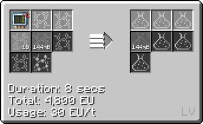

# Polytetrafluoroethylene

## How to make PTFE

### Option 1

**Step 1: Chemically react Hydrogen and Fluorine to make Hydrofluoric Acid.**

**Hydrofluoric Acid = Hydrogen + Fluorine (LCR)**

***Note that you can also make Tetrafluoroethylene wit Chloroform and Chlorine.***

**Recipe for Chloroform**

**Recipe for Tetrafluoroethylene from Chloroform**

**Step 2: Chemically react Hydrofluoric Acid, Methane and Chlorine to make Tetrafluoroethylene. (*Cir 24* IV LCR)**

 

Step 3a: Chemically react **Tetrafluoroethylene** and **Air/Oxygen** to get **Liquid PTFE**. **(Cir 1)**

Step 3b: You can also chemically react **Tetrafluoroethylene**, **Titanium Tetrachlorider** and **Air/Oxygen** to get *more* **Liquid PTFE**. **(Cir 1)**

***Rutile Dust + Carbon Dust + Chlorine = Carbon Monoxide + Titanium Tetrachloride***

### Option 2 

***Use the Chemical Plant to make Polytetrafluoroethylene from Fluorine and Carbon Dust. (Chem Plant LuV)***

## Uses of PTFE

**Making PTFE Casings for LCR (Cir 6)**

**Making IV Hatches/Busses**

**Making Petri Dishes**

**Making Battery Hulls**

**Used in Assembly line crafting**

### Uses of PTFE Plates

**Fluid solidify liquid PTFE to plates**

**Making Machine Hulls**

**IV Machine Hull**

**LuV Machine Hull**

**Making PTFE pipe casings**

