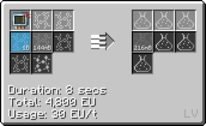
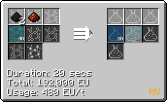
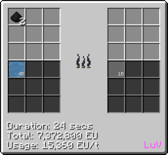
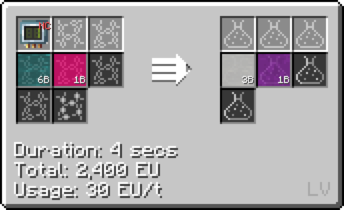
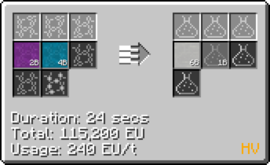
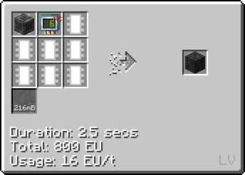
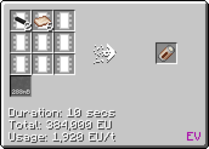
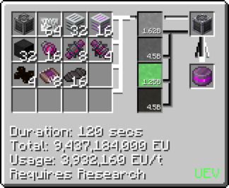
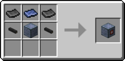
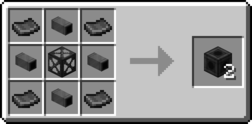

# Polytetrafluoroethylene (PTFE)
c
## How to make PTFE

### Option 1

**Step 1: Chemically react [Hydrofluoric Acid](/StarT-docs/Gameplay/Lines/Chemical Lines/Random Useful Chemicals/Hydrofluoric Acid), Methane and Chlorine to make Tetrafluoroethylene. <IV>(*Cir 24* IV LCR)</IV>**

 

Step 2a: Chemically react **Tetrafluoroethylene** and **Air/Oxygen** to get **Liquid PTFE**. **(Cir 1)**

Step 2b: You can also chemically react **Tetrafluoroethylene**, [Titanium Tetrachloride](/StarT-docs/Gameplay/Lines/Chemical Lines/Random Useful Chemicals/Titanium Tetrachloride) and **Air/Oxygen** to get *more* **Liquid PTFE**. **(Cir 1)**

***Rutile Dust + Carbon Dust + Chlorine = Carbon Monoxide + [Titanium Tetrachloride](/StarT-docs/Gameplay/Lines/Chemical Lines/Random Useful Chemicals/Titanium Tetrachloride)***

### Option 2 

***Use the Chemical Plant to make Polytetrafluoroethylene from Fluorine and Carbon Dust. <Luv>(Chem Plant LuV)</Luv>***

### Option 3 

***Note that you can also make Tetrafluoroethylene wit Chloroform and Chlorine.***

**Recipe for Chloroform**

**Recipe for Tetrafluoroethylene from Chloroform and [Hydrofluoric Acid](/StarT-docs/Gameplay/Lines/Chemical Lines/Random Useful Chemicals/Hydrofluoric Acid)**

## Uses of PTFE

**Making PTFE Casings for LCR (Cir 6)**

**Making <IV>IV</IV> Hatches/Busses**

**Making Petri Dishes <HV>(HV Fluid Solidifier)</HV>**

**Making Battery Hulls**

**Used in Assembly line crafting**

### Uses of PTFE Plates

**Fluid solidify liquid PTFE to plates**

**Making Machine Hulls**

**<iv>IV</iv> Machine Hull**

**<luv>LuV</luv> Machine Hull**

**Making PTFE pipe casings**

