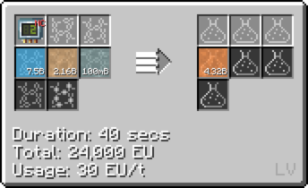

# Polyvinyl Butyral (PVB)

## How to make PVB

**Step 1: Make Butyraldehyde with Propene, Carbon Monoxide and Hydrogen<hv>(HV LCR)</hv>**

**Step 2: Make Vinyl Acetate with Oxygen, [Acetic Acid](/trulyno/StarT-docs/Gameplay/Lines/Chemical Lines/Random Useful Chemicals/Acetic Acid) and Ethylene (LCR Cir 3)**

**Step 3: Make Polyvinyl Acetate with Air/Oxygen, with/without [Titanium Tetrachloride](/trulyno/StarT-docs/Gameplay/Lines/Chemical Lines/Random Useful Chemicals/Titanium Tetrachloride)**

**With Air**

**Without [Titanium Tetrachloride](/trulyno/StarT-docs/Gameplay/Lines/Chemical Lines/Random Useful Chemicals/Titanium Tetrachloride) (Cir 1)* 

**With [Titanium Tetrachloride](/trulyno/StarT-docs/Gameplay/Lines/Chemical Lines/Random Useful Chemicals/Titanium Tetrachloride) (Cir 2)*

 

**With Oxygen**

**Without [Titanium Tetrachloride](/trulyno/StarT-docs/Gameplay/Lines/Chemical Lines/Random Useful Chemicals/Titanium Tetrachloride) (Cir 1)*

**With [Titanium Tetrachloride](/trulyno/StarT-docs/Gameplay/Lines/Chemical Lines/Random Useful Chemicals/Titanium Tetrachloride) (Cir 2)*

 

**Step 4: Make Polyvinyl Butyral with Butyraldehyde and Polyvinyl Acetate <hv>(HV LCR)</hv>**

## Uses of PVB plate

**Fluid solidify PVB into plate**

**Put the plates into a forming press with Tempered Glass to make Laminated Glass <hv>(HV LCR)</hv>**

