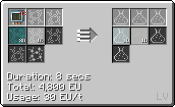
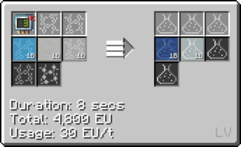
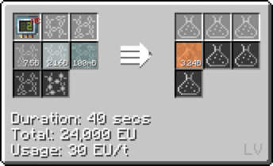
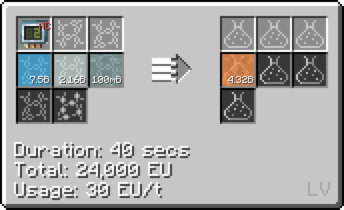
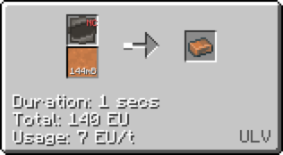
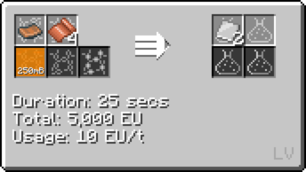

# Polyvinyl Chloride (PVC)

## How to make PVC

Step **1a**: Chemically React *Chlorine* and *Ethylene* to make Vinyl Chloride. **(LCR Cir 1)**

Step **1b**: Chemically React *Oxygen*, [Hydrochloric Acid](/StarT-docs/Gameplay/Lines/Chemical Lines/Random Useful Chemicals/Hydrochloric Acid) and *Ethylene* to make Vinyl Chloride. **(LCR Cir 3)**

Step **2a**: Chemically React *Vinyl Chloride* and *Air/Oxygen* to make Vinyl Chloride. **(LCR Cir 1)**

***With Air***

***With Oxygen***

Step **2b**: Chemically React *Vinyl Chloride* , [Titanium Tetrachloride](/StarT-docs/Gameplay/Lines/Chemical Lines/Random Useful Chemicals/Titanium Tetrachloride) and *Air/Oxygen* to make Vinyl Chloride. **(LCR Cir 2)**

***With Air***

***With Oxygen***

## Uses of PVC

### Uses of PVC Foil

**Fluid solidify PVC into ingots and bend them to get PVC foil (Cir 10)**

**Used by itself to coat wires**

**Used with other plastic foil to coat wire**

### USes of PVC Plate

**Used to make Plastic Circuit Boards**

**Used to make Hazmat Suits**

