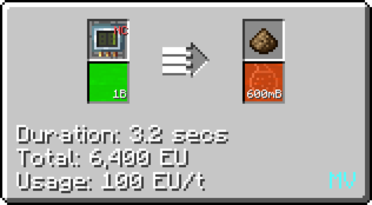
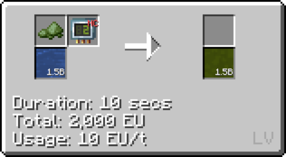
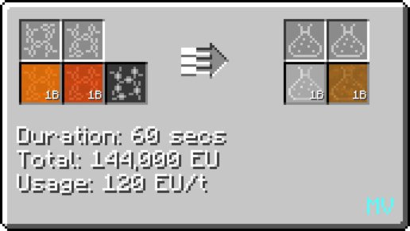
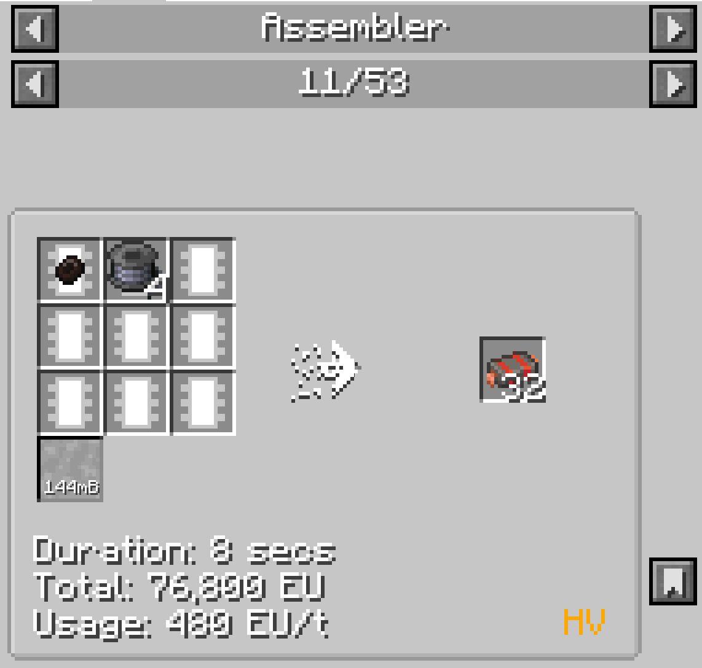

# Polyethylene

Polyethylene is a kind of plastic that is widely used in assembling recipes.

## How to make Polyethylene

**Firstly, Ethanol is a key component in making polyethylene and there are two ways to make it.**
***The first way of making ethanol:***

Step **1a**: Input biochaff and water inside of a **Pyrolyse Oven** on Circuit **1** to obtain **biomass**. (Minimum Energy Tier required : **LV**)

***Step 1.5: You can also use the LV Brewery to make Biomass from plants and water.*** 

Step **2a** : Distill biomass inside a **MV Distillery** on Circuit **1** to obtain ethanol. (Minimum Energy Tier required : **MV**)

***The second way of making ethanol:***

Step **1b**: Input biochaff and water inside of a **Pyrolyse Oven** on Circuit **2** to obtain **fermented biomass**. (Minimum Energy Tier required : **LV**)

Step **2b** : Distill **fermented biomass** inside a **MV Distillery** on Circuit **3** to obtain ethanol. (Minimum Energy Tier required : **MV**)

**After obtaining ethanol, the way of making polyethylene is basically the same.**

Step 3 : Chemically react **Ethanol** and **Sulfuric Acid** inside a **MV Chemical Reactor** to make Ethylene. (Minimum Energy Tier required : **MV**)

**After Step 3, based on your material situation, you can choose either using Oxygen or Air to make Polyethylene.**

Step **4** : Chemically react **Ethylene** and **Oxygen/Air** inside a **LV Chemical Reactor** to make Polyethylene. (Minimum Energy Tier required : **LV**)

## Uses of Polyethylene

Polyethylene is used in various assembling recipes such as SMD components.

