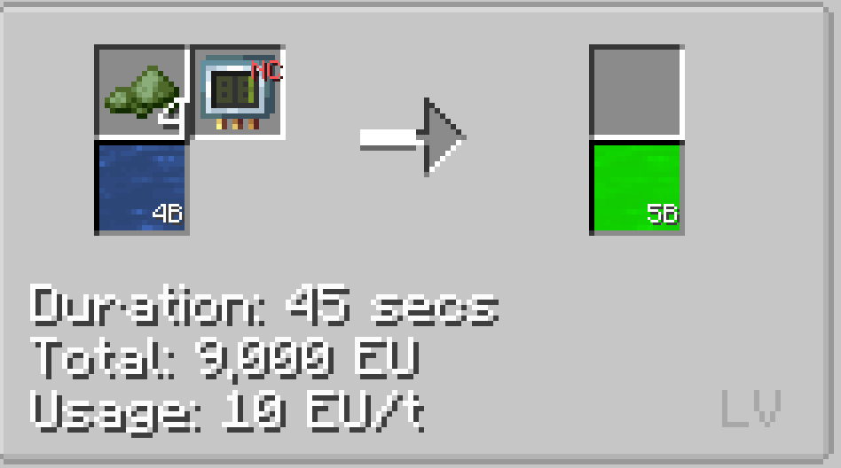
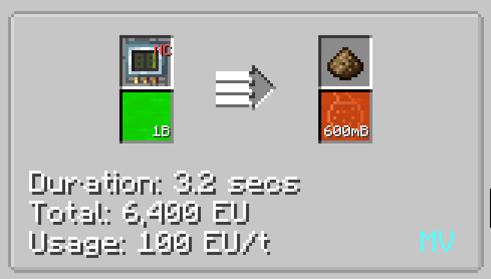
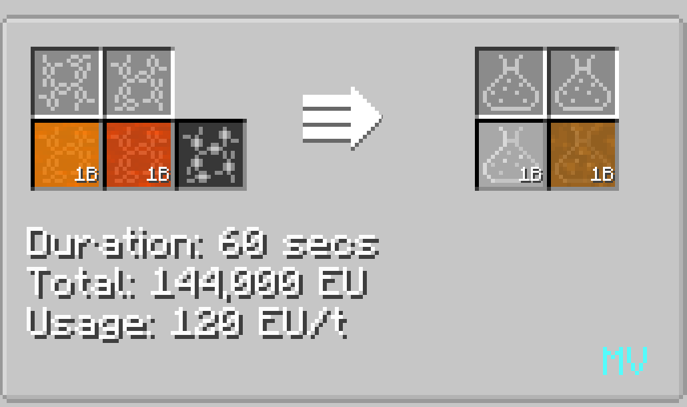
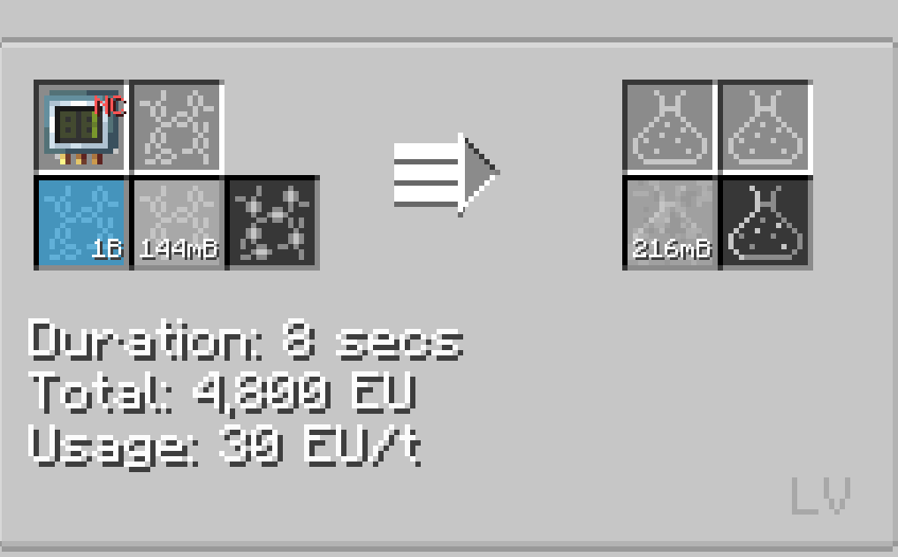

# Polyethylene

Polyethylene is a kind of plastic that is widely used in assembling recipes.

## Uses of Polyethylene

Polyethylene is used in various assembling recipes such as SMD components.

## How to make Polyethylene

Step 1 : Input biochaff and water inside of a **Pyrolyse Oven** to obtain biomass. (Minimum Energy Tier required : **LV**)

Step 2 : Distill biomass inside a **MV Distillery** to obtain ethanol. (Minimum Energy Tier required : **MV**)

Step 3 : Chemically react **Ethanol** and **Sulfuric Acid** inside a **MV Chemical Reactor** to make Ethylene. (Minimum Energy Tier required : **MV**)

Step 4 : Chemically react **Ethylene** and **Oxygen/Air** inside a **LV Chemical Reactor** to make Polyethylene. (Minimum Energy Tier required : **LV**)

