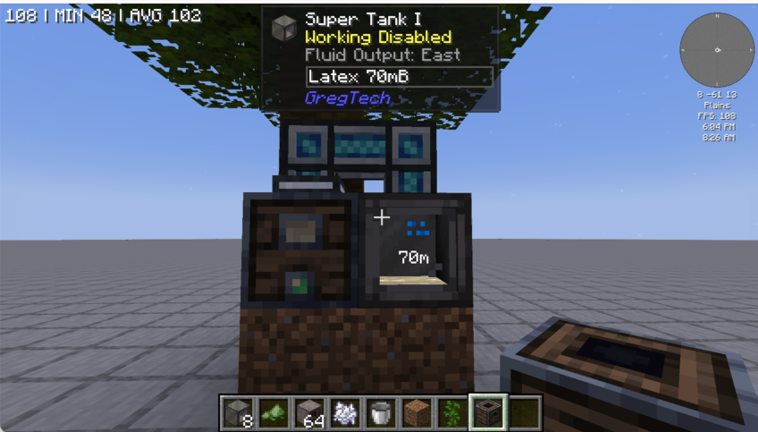
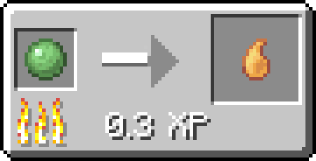
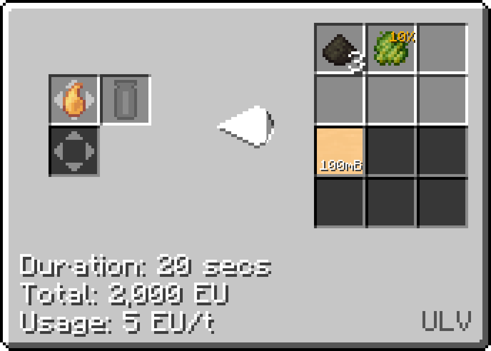
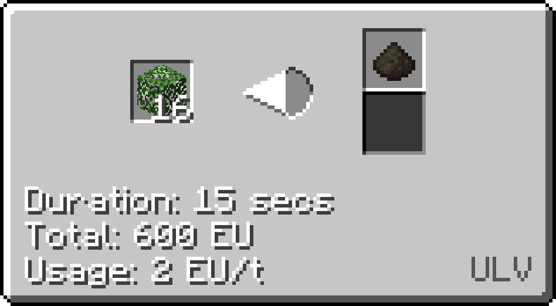
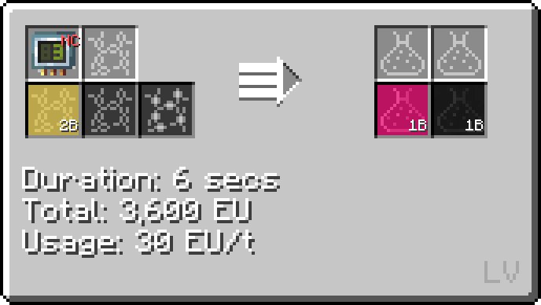
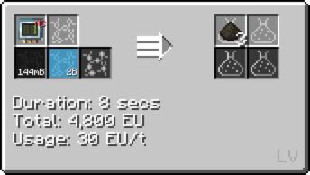
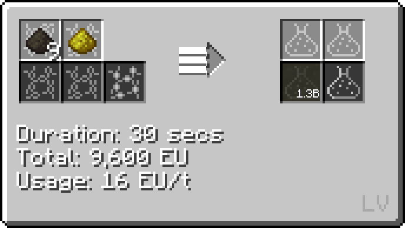

# Rubber

Rubber is a kind of plastic that is used in coating wires early game.

Rubber can be used in multiple forms such as in liquid form or in plate (sheet) form.

## How to make rubber

Step **1**: Put an arboreal extractor in front of a jungle tree to obtain **Latex**.

Step **2**: Either put the latex bucket in the crafting table or fluid solidify the latex to obtain rubber.

Note that you get better yield (4 from 1 bucket) from fluid solidifying latex.

Step **3**: Either cure the rubber into **cured rubber** or chemically react it with sulfur in the **LV Chemical Reactor** to obtain **liquid rubber**.

## An alternative way of making rubber

Step **1**: Use the **Wooden Barrel** to duplicate **Slitake Spores**.

Step **2**: Smelt down the **Slitake Spores** into **Slime Balls** and smelt it again into **Sticky Resin**.

Step **3**: Centrifuge the **Sticky Resin** into **Raw Rubber Pulp** and other byproducts such as **Glue**.

Step **3a**: You can also use an **LV Extractor** to extract **Raw Rubber PUupl** from **Leaves**.

Step **3b**: You can also create **Liquid Rubber** by chemically reacting **Propene** with **Circuit 3** to obtain **Isoprene**.

Next, Chemically react **Isoprene** with **Oxygen/Air** to get **Raw Rubber Pulp**.

Step **4**: Chemically React **Raw Rubber Pulp** and **Sulfur Dust** into **Liquid Rubber**.

## Uses of Liquid Rubber

Rubber can be fluid solidified into Rubber Plates to coat cables early-game.

Liquid rubber will be used instead of Rubber Plates to coat cables mid-game.

Rubber can also be fluid solidified into ingots and then **extruded** in an **MV Extruder** into **Rubber Rings** for other crafting uses such as different tiers of pumps.

**LV Pump**

**MV Pump**

