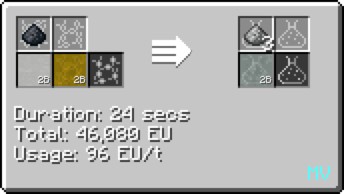
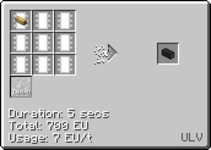

# Sillicone Rubber

Sillicone Rubber is a kind of plastic that is used in coating wires mid-game.

## How to make Sillicone Rubber

Step **1**: Obtain Polydimethylsiloxane Dust

Step **1a**: Chemically React Hydrochloric Acid, Methanol and Sillicon Dust inside a <MV> **MV Chemical Reactor** </MV>.

Step **1b**: Chemically React Sillicon Dust, Methane, Chlorine and Water on **Circuit 2** inside a <MV> **MV Chemical Reactor**</MV>.

Step **2**: Chemically React Polydimethylsiloxane Dust with Sulfur Dust to make Sillicone Rubber inside a <LV> **LV Chemical Reactor** </LV> .

## Uses of Sillicone Rubber

**Coating cables on its own**

**Coating cables with other foil**

**Making into foil for assembling recipes**

**FAL-84 Duct Tape**

**SMD Capacitor**

