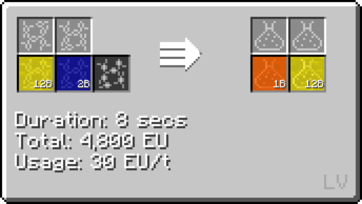
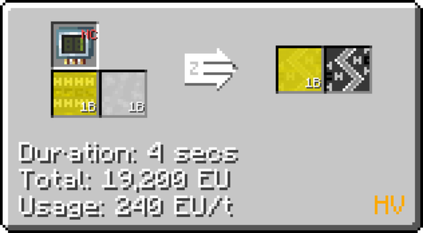
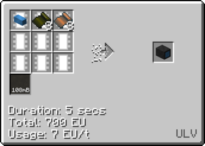

# Styrene Butadiene

## How to make Styrene Butadiene

**Styrene Butadiene is made from Styrene, Butadiene and Oxygen/Air.**

### How to make Styrene

Step **1**: Distill Oil in a Distillation Tower **(MV)**

Step **2**: Desulfurize Sulfuric Naphtha with Hydrogen to get Naphtha

Step **3**: Steam-crack the Naphtha in a Cracker with **Cir 1** **(HV)**

Step **4**: Distill the Lightly Steam-Cracked Naphtha in a Distillation Tower

### How to make Butadiene

Chemically React **Ethylene** and **Benzene** to get **Styrene**

### Making Styrene Butadiene

Step **1**: Chemically React **Styrene**, **Butadiene** with **Air/Oxygen** to get **Raw Styrene Butadiene Rubber Dust** **(HV LCR)**

Step **2**: Chemically react the **Raw Styrene Butadiene Rubber Dust** and **Sulfur Dust** to get **Styrene Butadiene**

## Uses of Styrene Butadiene

**Coating wires by itself**

**Coating wires with plastic foil**

**For Assembly Line Recipes**

### Uses of Styrene Butadiene Rings

**Fluid solidify Styrene Butadiene into ingots, then extrude them into rings**

***Quick Tip: Basically every extruder recipe requires at least MV to run, so don't make an LV Extruder!***

**Crafting pumps**

**Crafting UHV parts in the Component Part Assembly**

