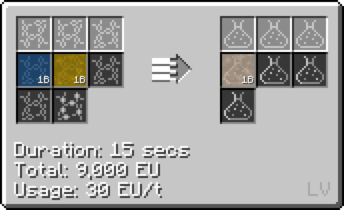

# Acetic Acid

## How to make Acetic Acid

**Option 1: Combine Carbon Dust, Hydrogen and Oxygen (LCR Cir 4)**

**Option 2: Combine Ethylene and Oxygen (LCR Cir 2)**

**Option 3: Combine Carbon Monoxide and Methanol (LCR)**

**Option 4: Combine Carbon Monoxide and Hydrogen (LCR Cir 2)**

