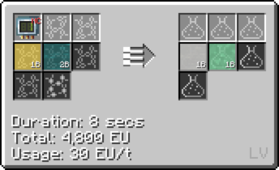

# Hydrochloric Acid

## How to make Hydrochloric Acid

**Option 1: Combine Chlorine and Hydrogen**

**Option 2: Obtain it as a byproduct of phenol (Benzene +  Chlorine + Water (Cir 24))**

**Option 3: Obtain it as a byproduct of allyl chloride (Propene + Chlorine (Cir 1))**

**Option 4: Obtain it as a byproduct of chloroform (Methane + Chlorine (Cir 1))**

**Option 5: Obtain it as a byproduct of tetrafluoroethylene (Methane + Hydrofluoric Acid + Chlorine (Cir 24))**

**Option 6: Obtain it as a byproduct of polydimetnylsiloxane dust (Sillicon Dust + Water + Chlorine + Methane (<mv>MV LCR</mv>))**

