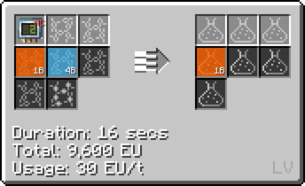
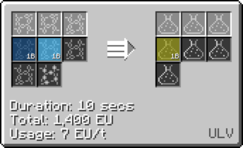
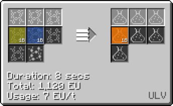

# Sulfuric Acid

## How to make Sulfuric Acid

#### Option 1: Combine Hydrogen Sulfide and Oxygen (LCR Cir 2)

#### Option 2: Combine Water and Sulfur Dust <hv>(HV LCR Cir 24)</hv>

#### Option 3: Combine Water, Oxygen and Sulfur in different steps.

**Step 1: Combine Sulfur and Oxygen (LCR Cir 2)**

**Step 2: Combine Sulfur Dioxide with Oxygen**

**Step 3: Combine Sulfur Trioxide with Water**

