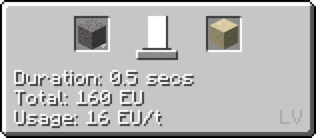
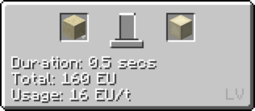
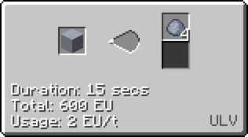

# Clay Electrolysis

## How to make Clay

**Step 1: Put Cobblestone in a forge hammer three times to obtain dust.**

**Step 2: Put Dust in a Large Barrel with Water to obtain Clay.**

**Step 3: Put Clay in an extractor to obtain Clay balls (or break them by hand)**

**Step 4: Put Clay Balls in the Macerator to obtain Clay Dust**

**Step 5: Put Clay Dust in an <mv>MV</mv> Electrolyzer to obtain Sodium, Lithium, Aluminium and Sillicon Dust**

*Note that you can void water using a fluid trash can.*

